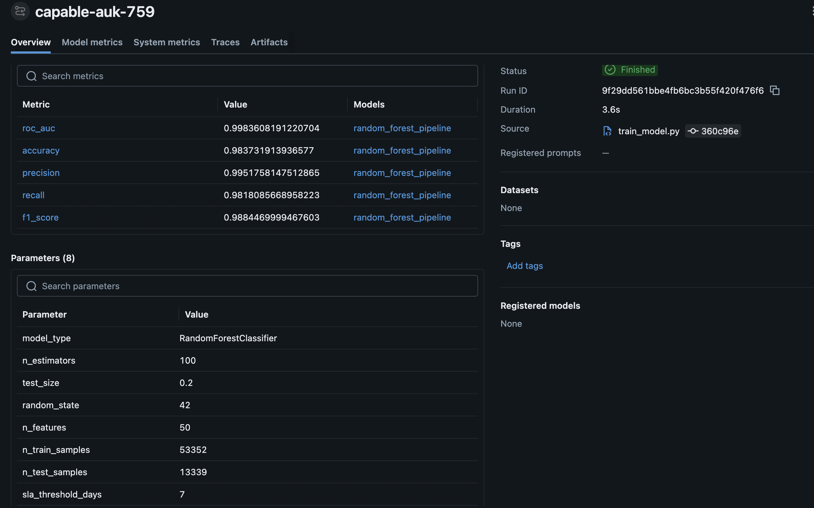
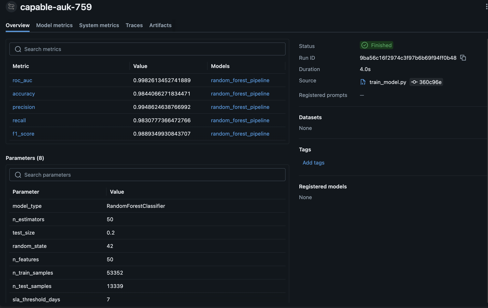

# PHASE 2: Enhancing ML Operations with Containerization & Monitoring

## Overview
Phase 2 adds the operational layer on top of the Phase 1 model — Docker for consistent environments, Hydra for config management, MLflow for experiment tracking, Rich logging, cProfile and Scalene for profiling, and psutil-based monitoring. The goal was to make the pipeline something you can hand off to a teammate and have it actually work on their machine.

---

## 1. Containerization

- [x] **Dockerfile Creation**: Dockerfile created for containerized model training
- [x] **Base Image Selection**: Uses required `python:3.11-slim-bookworm` base image
- [x] **Environment Variables**: `PYTHONUNBUFFERED=1` configured for reliable container logging
- [x] **Build Instructions**: Docker build command documented in README
- [x] **Run Instructions**: Docker run command documented with mounted `models/` and `data/processed/` volumes
- [x] **Container Testing**: Container tested locally and successfully runs training end-to-end
- [x] **Environment Consistency**: Containerized training produces comparable results to local training

### Verified Docker Commands

```bash
docker build -f dockerfiles/Dockerfile -t helpevents .
```

```bash
docker run --rm \
  -v "$PWD/models:/app/models" \
  -v "$PWD/data/processed:/app/data/processed" \
  helpevents
```

### Verified Container Metrics

- ROC-AUC: 0.9984
- Accuracy: 0.9837
- Precision: 0.9952
- Recall: 0.9818
- F1 Score: 0.9884

---

## 2. Monitoring & Debugging

- [x] **Debugging Tools**: pdb/ipdb available for interactive debugging
- [x] **Debugging Documentation**: pdb usage documented below
- [x] **Debug Scenario 1**: Resolved feature mismatch where training expected `events_per_day` but stale processed data did not contain it
- [x] **Debug Scenario 2**: Resolved data leakage causing artificially perfect training scores
- [x] **Logging for Debugging**: Training pipeline logs data path, row count, feature count, target distribution, train/test split, and model metrics
- [x] **Model Assertion Checks**: Training code validates expected target and feature columns
- [x] **Training Validation**: Training logs target distribution and dataset dimensions before fitting model
- [x] **Resource Monitoring**: `scripts/monitor_training.py` polls CPU and RAM via psutil and writes `reports/monitoring/training_monitor.csv`

### Debugging with pdb / ipdb

Python's built-in `pdb` debugger (or the enhanced `ipdb` drop-in) can be inserted anywhere in the pipeline to pause execution and inspect live state.

**Insert a breakpoint:**

```python
import pdb; pdb.set_trace()   # stdlib
# or
import ipdb; ipdb.set_trace()  # pip install ipdb
```

**Python 3.7+ shorthand:**

```python
breakpoint()  # uses PYTHONBREAKPOINT env var; defaults to pdb
```

**Useful pdb commands:**

| Command | Action |
|---|---|
| `n` | Step to next line |
| `s` | Step into function call |
| `c` | Continue to next breakpoint |
| `p <expr>` | Print expression |
| `pp <expr>` | Pretty-print expression |
| `l` | List surrounding source lines |
| `q` | Quit debugger |

**Example — inspect feature DataFrame before training:**

```python
# in train_model.py, after building x and y
import pdb; pdb.set_trace()
# at the prompt: pp x.columns.tolist()
# at the prompt: pp x.shape
```

### Debug Scenario 1: Feature Contract Mismatch

During Docker testing, training failed because the model expected the `events_per_day` feature, but the mounted processed dataset was stale and did not include that column. The fix was to regenerate processed data with the current feature engineering pipeline using:

```bash
make data
```

Then rerun the containerized training command. The takeaway: if you change `build_features.py`, always rerun `make data` before `make train`. Stale processed data will silently produce wrong features with no obvious error message.

### Debug Scenario 2: Data Leakage Causing Perfect Scores

Early training runs came back with ROC-AUC 1.0000 and F1 1.0000. That's not a good sign — it means the model is cheating somehow. We dropped a breakpoint and checked the feature columns. `wf_total_time` was in the training data. Since `sla_violation` is literally just `wf_total_time > threshold`, the model had the answer sitting right there as a feature. Any model would get 100% on that.

**Fix applied in `train_model.py` and `profile_training.py`:**

```python
leaky_cols = ["id", "sla_violation", "wf_total_time", "total_time_days", "log_total_time"]
x = df.drop(columns=[c for c in leaky_cols if c in df.columns])
```

After removing the leaky columns, the model achieved realistic scores: ROC-AUC 0.9984, F1 0.9884.

### Resource Monitoring

`scripts/monitor_training.py` launches the training pipeline as a subprocess and samples CPU and RAM every 0.5 seconds using `psutil`.

```bash
python scripts/monitor_training.py
```

Output CSV: `reports/monitoring/training_monitor.csv`

Example summary output:

```text
--- Training Monitor Summary ---
  Total time   : 42.5s
  Peak RAM     : 1243.8 MB
  Peak CPU     : 98.2%
  Avg CPU      : 61.4%
  Samples      : 85
  CSV saved to : reports/monitoring/training_monitor.csv
```

---

## 3. Profiling & Optimization

- [x] **CPU Profiling**: `scripts/profile_training.py` profiles the training pipeline with cProfile
- [x] **Profiling Results**: Top-25 hotspots saved to `reports/profiling/train_profile_summary.txt`
- [x] **Profiling Binary**: Full profile saved to `reports/profiling/train_profile.prof` for interactive inspection
- [x] **Scikit-learn Profiling**: `scripts/profile_with_scalene.py` profiles the same training workload with Scalene for line-level CPU and memory evidence
- [x] **Scalene Report**: Text report saved to `reports/profiling/scalene_training_profile.txt`
- [x] **Optimization 1**: Identified that `pd.get_dummies` dominates pre-model time; one-hot encoding is applied once at preprocessing rather than per-predict
- [x] **Optimization 2**: `RandomForestClassifier` uses `n_jobs=-1` to parallelize tree construction across all CPU cores
- [x] **Optimization Documentation**: Findings documented below
- [x] **Memory Profiling**: Scalene captures line-level memory peaks for the scikit-learn training path
- [x] **GPU Profiling Not Applicable**: Project uses scikit-learn on CPU, so Scalene is the appropriate framework-level profiling evidence

### Running the Profiler

```bash
python scripts/profile_training.py
```

This produces two outputs:

```text
reports/profiling/train_profile.prof          # binary — load with pstats
reports/profiling/train_profile_summary.txt   # human-readable top-25 hotspots
```

To explore the binary profile interactively:

```bash
python -m pstats reports/profiling/train_profile.prof
# at the prompt: sort cumulative
# at the prompt: stats 25
```

### Running Scalene for scikit-learn Profiling

Because this project uses scikit-learn instead of PyTorch or TensorFlow, Scalene is the framework-appropriate profiler for line-level CPU and memory evidence. The wrapper below runs the same training workload used by the cProfile script and saves a compact text report:

```bash
python scripts/profile_with_scalene.py
```

Output:

```text
reports/profiling/scalene_training_profile.txt
```

### Profiling Findings

Most of the time is in `RandomForestClassifier.fit`, joblib worker coordination, and sklearn import/model setup, which is expected for this CPU-bound classical ML pipeline. We already have `n_jobs=-1` so Random Forest uses all cores. Scalene reported peak memory around 217 MB for the profiled training path, with the highest memory lines tied to loading the processed dataframe, one-hot encoding, and fitting the model. `StandardScaler` barely shows up.

At 66k rows there's nothing obviously worth optimizing. If the dataset gets significantly larger, the thing to look at first would be replacing `pd.get_dummies` with an `OrdinalEncoder` inside the sklearn pipeline so the encoding is properly fitted once rather than done manually before training.

---

## 4. Experiment Management & Tracking

- [x] **MLflow Setup**: MLflow integrated into training pipeline
- [x] **Metric Logging**: Accuracy, precision, recall, F1, and ROC-AUC logged for each run
- [x] **Parameter Logging**: Model parameters and configuration values logged (including `max_depth`, `min_samples_split`, `min_samples_leaf`)
- [x] **Model Artifact Logging**: Trained scikit-learn model logged to MLflow and saved to `models/model.joblib`
- [x] **Experiment Comparison**: Four Hydra-driven MLflow runs completed and compared
- [x] **Visualization**: MLflow screenshots added under `reports/screenshots/`
- [x] **Best Model Selection**: Accuracy, F1 score, ROC-AUC, and recall reviewed for model selection
- [x] **Experiment Documentation**: Experiment summary table added below

### Current Baseline Result

- Model: Random Forest
- ROC-AUC: 0.9984
- Accuracy: 0.9837
- Precision: 0.9952
- Recall: 0.9818
- F1 Score: 0.9884

### Viewing MLflow Runs

MLflow stores local tracking data under `./mlruns`. A teammate can launch the UI from the repository root with:

```bash
mlflow ui --backend-store-uri ./mlruns
```

Then open `http://127.0.0.1:5000` to compare runs, inspect logged parameters, and download model artifacts.

### MLflow Experiment Comparison

Four MLflow runs were completed using Hydra configuration overrides. Each run logged model parameters, evaluation metrics, and trained model artifacts.

| Run | Configuration Change | ROC-AUC | Accuracy | Precision | Recall | F1 Score |
|---|---|---:|---:|---:|---:|---:|
| Baseline | `n_estimators=100`, `test_size=0.2` | 0.9984 | 0.9837 | 0.9952 | 0.9818 | 0.9884 |
| Smaller Random Forest | `n_estimators=50`, `test_size=0.2` | 0.9983 | 0.9844 | 0.9949 | 0.9831 | 0.9889 |
| Larger Random Forest | `n_estimators=200`, `test_size=0.2` | 0.9984 | 0.9841 | 0.9959 | 0.9816 | 0.9887 |
| Larger Test Split | `n_estimators=100`, `test_size=0.3` | 0.9984 | 0.9849 | 0.9949 | 0.9837 | 0.9893 |

The 30% test split run edged out the others on accuracy and F1. The 50-tree run was close to baseline and trains noticeably faster, so it's worth considering if you're iterating quickly. MLflow was genuinely useful here — being able to pull up all four runs side by side and compare every metric without digging through log files saved a lot of time.

#### MLflow Evidence Screenshots






---

## 5. Application & Experiment Logging

- [x] **Logger Setup**: Rich logging configured for training pipeline
- [x] **Rich Library Setup**: `rich.logging.RichHandler` integrated for colored console output
- [x] **Log Levels**: INFO and WARNING messages used during training and MLflow execution
- [x] **Log Messages**: Informative logs added at key points in the pipeline
- [x] **Training Log Example**: Docker run output demonstrates training logs
- [x] **Error Logging**: `rich.traceback.install()` produces formatted tracebacks on unhandled exceptions
- [x] **Log Rotation**: `RotatingFileHandler` writes to `logs/app.log` with 5 MB cap and 3 backup files

### How Logging Works

Everything is configured in `src/se_489_mlops_project/logging_config.py`. There are two handlers:

- **Console** — `RichHandler` from the `rich` library, so log levels show up color-coded in the terminal and are actually readable.
- **File** — `RotatingFileHandler` writing to `logs/app.log`. Caps out at 5 MB and keeps 3 backups so it doesn't fill up disk on long runs.

We also call `rich.traceback.install()` at import time, so if something crashes you get a proper formatted traceback instead of a wall of text.

### Example Console Output (Rich)

```text
[10:42:01] INFO     Training with data=data/processed          train_model.py:43
           INFO     Loaded 66691 records                       train_model.py:47
           INFO     Features: 50, Target: sla_violation        train_model.py:62
           INFO     Training Random Forest classifier...       train_model.py:98
           INFO     ROC-AUC Score: 0.9984                      train_model.py:121
           INFO     Model saved to models/model.joblib         train_model.py:135
```

### Using the Logger in New Modules

```python
from se_489_mlops_project.logging_config import get_logger

logger = get_logger(__name__)
logger.info("Processing %d records", len(df))
logger.warning("Missing values detected in column: %s", col)
```

---

## 6. Configuration Management

- [x] **Hydra Setup**: Hydra integrated into training pipeline
- [x] **Config Files**: `configs/config.yaml` is the default configuration
- [x] **Config Structure**: Config includes `experiment`, `data`, `model`, and `training` sections
- [x] **Config Example 1**: Default Random Forest config (`configs/config.yaml`)
- [x] **Config Example 2**: Larger forest experiment config (`configs/experiment/larger_forest.yaml`)
- [x] **Config Example 3**: Fast/lightweight experiment config (`configs/experiment/fast.yaml`)
- [x] **Override Documentation**: CLI override and experiment group commands documented below
- [x] **Config Version Control**: All config files committed with source code

### Configuration Files

```text
configs/
├── config.yaml                    # default training config
└── experiment/
    ├── larger_forest.yaml         # 200 trees, deeper forest
    └── fast.yaml                  # 25 trees for quick iteration
```

### Running with a Named Experiment Config

```bash
# Use the larger forest preset
python -m se_489_mlops_project.train_model +experiment=larger_forest

# Use the fast / lightweight preset
python -m se_489_mlops_project.train_model +experiment=fast
```

### Ad-hoc Overrides (no config file needed)

```bash
# Override any parameter inline
python -m se_489_mlops_project.train_model model.n_estimators=200 training.test_size=0.3
```

---

## 7. Documentation & Repository Updates

- [x] **README Update**:
  - [x] Containerization section with Docker usage
  - [x] Profiling guide (`scripts/profile_training.py`)
  - [x] Experiment tracking setup instructions
  - [x] Configuration management guide with experiment config groups
  - [x] Logging usage examples (Rich + file rotation)
  - [x] Monitoring section (`scripts/monitor_training.py`)
- [x] **Architecture Documentation**: README includes architecture overview
- [x] **Setup Guide**: README includes setup and execution commands
- [x] **Examples**: Docker, Hydra, profiling, and monitoring examples documented
- [x] **Tool Integration**: MLflow, Docker, Hydra, Rich, psutil integration all documented
- [x] **Version Compatibility**: Docker base image and Python version documented
