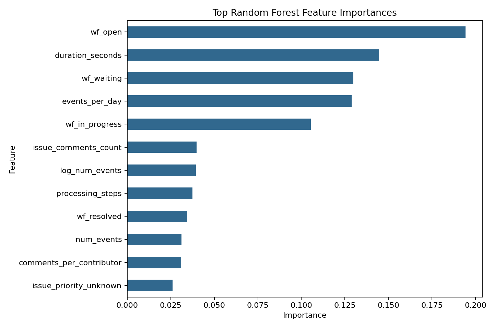
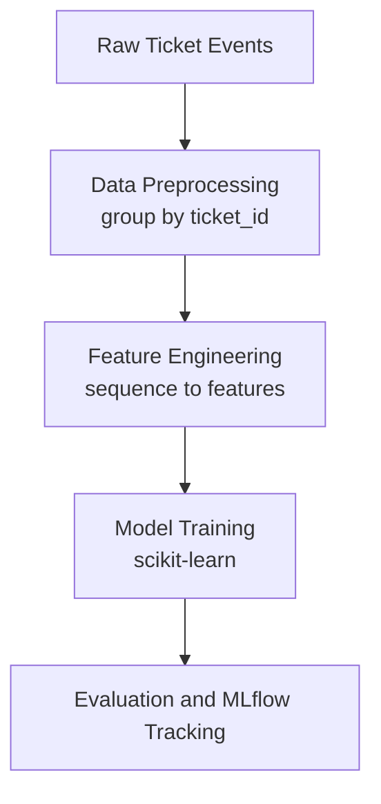
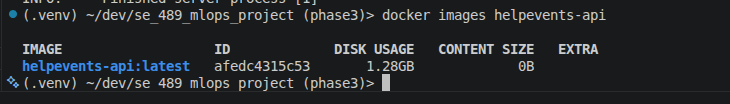
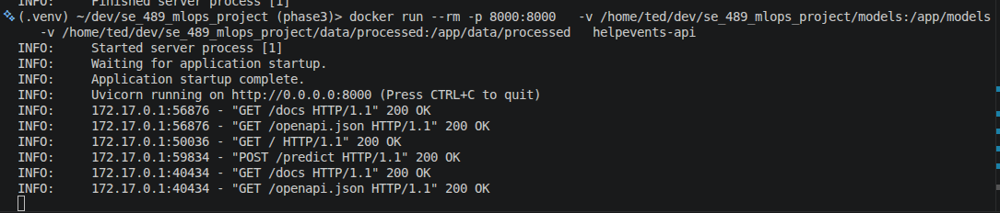
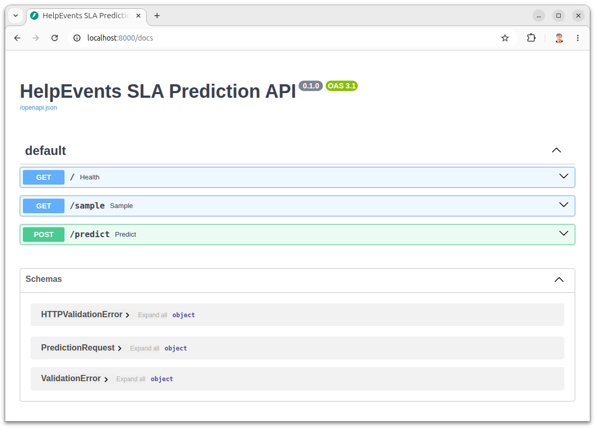
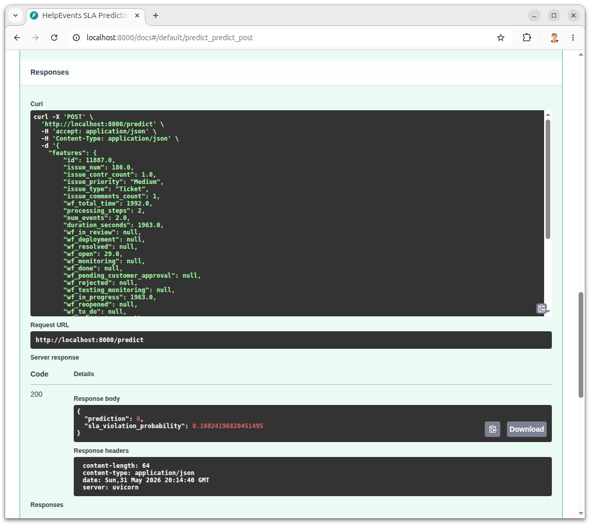
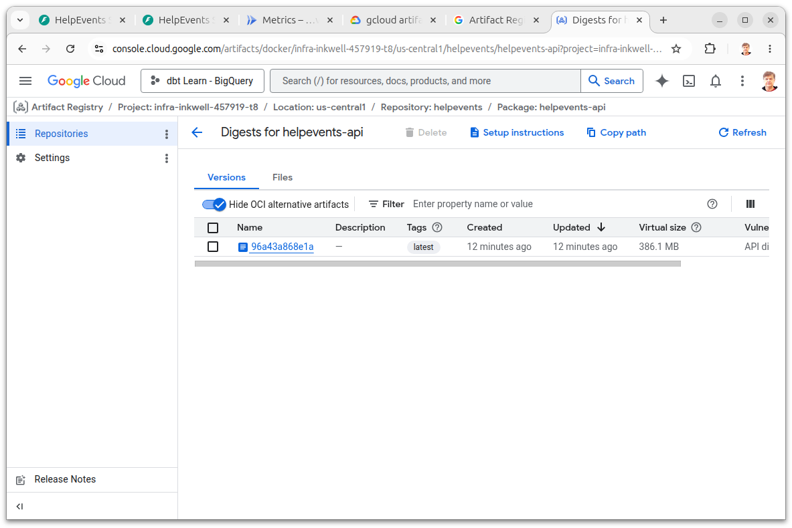
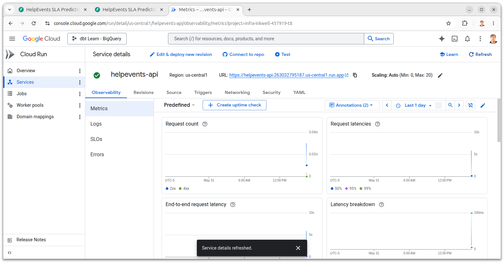
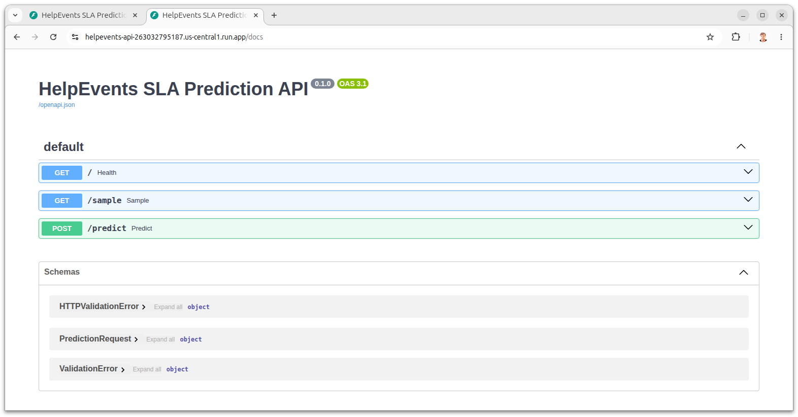
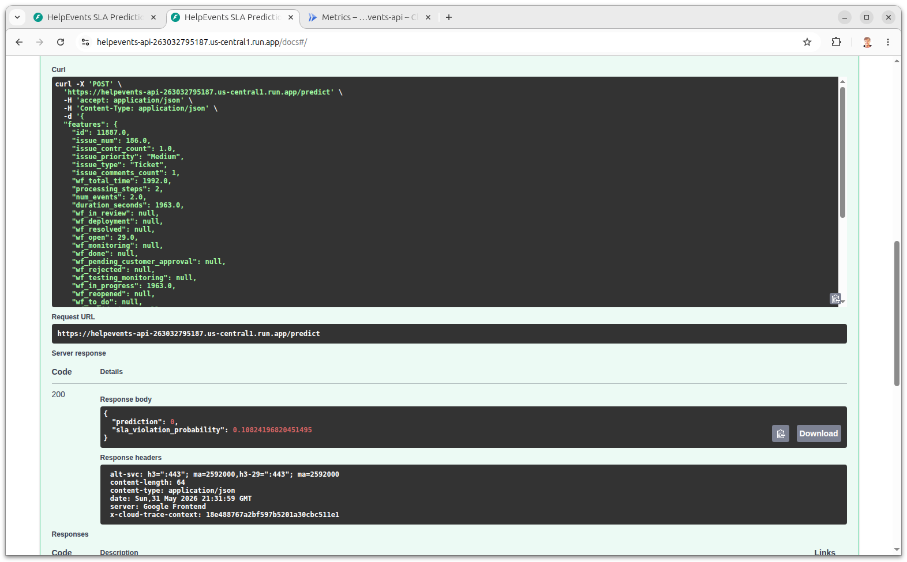

# SE 489 MLOps Project - HelpEvents

Predict SLA violations from event sequences

## Phase 3 Demo Recording

> **TODO before final submission:** Embed or link the required 2-5 minute narrated/captioned end-to-end demo here.
>
> Recording link: `TODO: paste Loom, YouTube, Hugging Face, or repo video link`
>
> The recording should show the Hugging Face Streamlit app, a realistic support-ticket input, the SLA-risk prediction, and evidence that the request reached the deployed FastAPI backend on GCP Cloud Run or Cloud Functions.

## Team Information

- **Project Lead:** Ted Strall (tstrall@depaul.edu)
- **Team Members:**
  - Calvin Au (CAU4@depaul.edu)
  - Seshagiri Kalyana Venkatesh Adavi (sadavi@depaul.edu)
  - Julisa Delfin (jdelfing@depaul.edu)

## Project Overview

### Problem Statement

IT helpdesk teams operate under Service Level Agreements (SLAs) that define the maximum time allowed to resolve a support ticket. When tickets breach these thresholds, the consequences range from contractual penalties to degraded customer trust. Currently, support teams have no early-warning system - they only discover an SLA violation after it has already occurred. The goal of this project is to predict, as early as possible in a ticket's lifecycle, whether that ticket is likely to violate its SLA, so support managers can intervene proactively.

### What We Are Building

HelpEvents is an end-to-end MLOps pipeline that trains a binary classification model on real-world helpdesk data. Given a set of features about a support ticket - its priority, type, number of contributing agents, comment activity, and the history of workflow state changes - the model predicts whether the ticket will exceed the 7-day SLA threshold.

The raw dataset comes from a public Mendeley repository and contains over 150,000 helpdesk tickets spanning 2016 to 2023, including a change-history table that records every workflow event associated with each ticket. We transform these event sequences into structured, per-ticket features using a deterministic preprocessing pipeline. Feature engineering steps include computing ticket event density (events per active day), contributor-to-comment ratios, log-scaled resolution time, and binary priority flags. All transformations are implemented as reusable Python functions so the same logic runs identically at training time and inference time.

### Model and Framework

The classifier is a `RandomForestClassifier` wrapped in a scikit-learn `Pipeline` with a `StandardScaler` preprocessing stage. Random Forest was chosen because it handles mixed feature types naturally, is robust to outliers, and produces well-calibrated probability estimates that are critical for ranking tickets by violation risk. We evaluate with accuracy, precision, recall, F1, and ROC-AUC.

The key third-party framework integrated into this project is **MLflow**. Every training run logs its hyperparameters, evaluation metrics, and the serialized model artifact to a local MLflow tracking server. This makes experiments fully reproducible and comparable - a core MLOps requirement.

The trained Random Forest's feature-importance analysis supports the modeling story: ticket workflow intensity and interaction features are among the strongest predictors after removing leakage-prone duration fields.



### Expected Impact

A deployed version of this model would allow a support team to flag high-risk tickets in real time and prioritize them for escalation, directly reducing the rate of SLA violations. Success is measured primarily by ROC-AUC (ability to rank tickets by risk) and recall (minimizing missed violations).

**Key Objectives:**
- [x] Transform event sequences into structured features for modeling
- [x] Build a reproducible machine learning training pipeline
- [x] Track experiments and model performance using MLflow

## Dataset

Source: https://data.mendeley.com/datasets/btm76zndnt/2

The dataset contains helpdesk ticket data including:
- ticket metadata
- interaction events
- timestamps for messages and updates

### Target Variable

SLA violation is defined as:

SLA_violation = 1 if resolution_time > SLA_threshold

> Note: `wf_total_time` is used only to derive the SLA target variable and for exploratory analysis. It is intentionally excluded from the final training feature set to prevent target leakage.

## Architecture Diagram



## Phase Deliverables

### Phase 1: Project Design & Model Development
- See [PHASE1.md](PHASE1.md) for detailed checklist

### Phase 2: Containerization & Monitoring
- See [PHASE2.md](PHASE2.md) for detailed checklist

### Phase 3: CI/CD & Deployment
- See [PHASE3.md](PHASE3.md) for detailed checklist

## Setup Instructions

### Prerequisites
- Python 3.11+ installed
- Git installed
- (Optional) Docker and Docker Compose

### Installation

**Option 1: Using uv (recommended - faster)**
```bash
pip install uv
uv pip install -r requirements.txt
```

**Option 2: Using pip**
```bash
pip install -U pip
pip install -r requirements.txt
```

### Development Setup

```bash
# Install development dependencies
pip install -r requirements_dev.txt

# Set up pre-commit hooks
pre-commit install

# Run tests to verify setup
pytest tests/
```

### Running the Pipeline

```bash
# Prepare data
make data

# Train the model
make train

# Generate predictions
make predict

# See all available commands
make help
```

## Phase 2: Containerized Training

The project includes a Docker-based training environment for reproducible machine learning workflows and operational consistency across environments.

### Build Docker Image

```bash
docker build -f dockerfiles/Dockerfile -t helpevents .
```

### Run Containerized Training

```bash
docker run --rm \
  -v "$PWD/models:/app/models" \
  -v "$PWD/data/processed:/app/data/processed" \
  helpevents
```

This mounts local processed datasets and trained model artifacts into the container so outputs persist outside the runtime environment.

### Hydra Configuration

The training pipeline uses Hydra configuration management for reproducible experimentation and parameter overrides.

Configuration files are stored under `configs/`:

```text
configs/
├── config.yaml                    # default training config
└── experiment/
    ├── larger_forest.yaml         # 200 trees, deeper forest
    └── fast.yaml                  # 25 trees for quick iteration
```

Run with a named experiment preset:

```bash
python -m se_489_mlops_project.train_model +experiment=larger_forest
python -m se_489_mlops_project.train_model +experiment=fast
```

Ad-hoc parameter overrides:

```bash
python -m se_489_mlops_project.train_model model.n_estimators=200 training.test_size=0.3
```

### MLflow Experiment Tracking

Training runs log parameters, metrics, and model artifacts to the local `mlruns/` tracking directory. To view the logged runs and compare experiments, launch the MLflow UI from the repository root:

```bash
mlflow ui --backend-store-uri ./mlruns
```

Then open `http://127.0.0.1:5000` in a browser. Screenshots of the completed comparison runs are checked in under `reports/screenshots/`.

### Logging

Logging uses `rich` for colored terminal output — log levels are color-coded and timestamps are included. Logs also write to `logs/app.log` with rotation at 5 MB (3 backups kept). If a run crashes, the traceback is formatted by `rich` with local variable values shown.

To use the logger in a new module:

```python
from se_489_mlops_project.logging_config import get_logger

logger = get_logger(__name__)
logger.info("Loaded %d records", len(df))
```

### Profiling

Profile the full training pipeline with cProfile:

```bash
python scripts/profile_training.py
```

Outputs:

```text
reports/profiling/train_profile.prof          # binary — load with pstats
reports/profiling/train_profile_summary.txt   # human-readable top-25 hotspots
```

Explore the binary profile interactively:

```bash
python -m pstats reports/profiling/train_profile.prof
```

For scikit-learn line-level CPU and memory profiling, run the Scalene wrapper:

```bash
python scripts/profile_with_scalene.py
```

Scalene writes its text report to:

```text
reports/profiling/scalene_training_profile.txt
```

### Resource Monitoring

Track CPU and RAM during a training run:

```bash
python scripts/monitor_training.py
```

Samples every 0.5 seconds and writes to `reports/monitoring/training_monitor.csv`. Prints peak RAM, peak CPU, and total run time when it finishes.

### Verified Docker Training Results

The containerized training pipeline successfully produced:

- ROC-AUC: 0.9984
- Accuracy: 0.9837
- Precision: 0.9952
- Recall: 0.9818
- F1 Score: 0.9884

The trained model artifact is saved to:

```text
models/model.joblib
```

## Phase 3: Continuous ML and Deployment

Phase 3 turns the tracked training pipeline into an automated and reachable system. The repository now includes GitHub Actions workflows for CI, Docker image building, CML pull-request reporting, and Hugging Face Space sync:

```text
.github/workflows/ci.yml
.github/workflows/docker-build.yml
.github/workflows/cml.yml
.github/workflows/huggingface-space.yml
```

The deployed serving path uses the FastAPI app in `api/main.py`. It exposes:

- `GET /` health check
- `GET /sample` sample request payload from processed data
- `POST /predict` SLA violation prediction

### Dockerized FastAPI Service Evidence

The FastAPI service has been packaged as a Docker image and verified locally with the trained model and processed data mounted into the container.





The API exposes interactive Swagger documentation at `/docs`:



The containerized `/predict` endpoint returns a successful SLA prediction response:



### GCP Cloud Run Deployment Evidence

The Docker image was pushed to Google Artifact Registry and deployed as a public Cloud Run service at:

```text
https://helpevents-api-263032795187.us-central1.run.app
```





The deployed Cloud Run API exposes the same FastAPI Swagger documentation:



The public `/predict` endpoint returns a successful SLA prediction response from the deployed service:



Run the API locally:

```bash
make api
```

Run the API with Docker Compose:

```bash
docker compose up api
```

Example prediction request:

```bash
curl -X POST http://localhost:8000/predict \
  -H "Content-Type: application/json" \
  -d @request.json
```

The repository includes `request.json` as a checked-in sample payload generated from the processed dataset. A minimal inline request also works:

```bash
curl -X POST http://localhost:8000/predict \
  -H "Content-Type: application/json" \
  -d '{
    "features": {
      "issue_contr_count": 1,
      "issue_comments_count": 3,
      "processing_steps": 4,
      "num_events": 8,
      "duration_seconds": 3600,
      "issue_priority": "Medium",
      "issue_type": "Ticket",
      "events_per_day": 8,
      "comments_per_contributor": 3,
      "is_high_priority": 0,
      "log_num_events": 2.197224577
    }
  }'
```

The user-facing demo app lives in `app/streamlit_app.py` and is designed for deployment on Hugging Face Spaces. Set `HELPEVENTS_API_URL` in the Space environment to point at the deployed Cloud Run or Cloud Functions backend.

Phase 3 evidence and remaining manual screenshot tasks are tracked in:

- [PHASE3.md](PHASE3.md)
- [docs/PHASE3_HANDOFF.md](docs/PHASE3_HANDOFF.md)
- [DEPLOYMENT.md](DEPLOYMENT.md)


## Technology Stack

### Core Dependencies
- **numpy** >= 1.26.0 - Numerical computing
- **pandas** >= 2.2.0 - Data manipulation
- **scikit-learn** >= 1.5.0 - Machine learning algorithms
- **matplotlib** >= 3.9.0 - Visualization
- **tqdm** >= 4.66.0 - Progress bars
- **pyyaml** >= 6.0 - Configuration files

### Experiment Tracking
- **mlflow** >= 2.16.0 - MLflow experiment tracking

### Logging & Monitoring
- **rich** >= 13.0.0 - Colored console logging and formatted tracebacks
- **psutil** >= 5.9.0 - CPU and memory monitoring during training

### Development Tools
- **pytest** >= 8.0 - Testing framework
- **pytest-cov** >= 5.0 - Code coverage
- **ruff** >= 0.6.0 - Linting and formatting
- **mypy** >= 1.11 - Static type checking
- **pre-commit** >= 3.8 - Git hooks framework

### Containerization
- **Docker** - Reproducible containerized training environment

### Configuration Management
- **Hydra** - Config-driven experimentation and parameter overrides

### Deployment and UI
- **FastAPI** - HTTP prediction service
- **Uvicorn** - ASGI server for local and Cloud Run serving
- **Streamlit** - Hugging Face Spaces user interface


## Project Structure

This template uses the modern **`src/` layout** - the importable package lives in `src/se_489_mlops_project/`, decoupled from the repository root. That forces `pip install -e .` before imports work, which catches packaging bugs early.

```
se_489_mlops_project/                  # Repository root
├── src/
│   └── se_489_mlops_project/          # Importable Python package
│       ├── __init__.py                # Version + package metadata
│       ├── config.py                  # Paths & typed config (PROJECT_ROOT, TrainingConfig, ...)
│       ├── logging_config.py          # setup_logging() + get_logger()
│       ├── data/
│       │   ├── __init__.py
│       │   ├── loaders.py             # load_raw / load_processed / save_processed
│       │   └── make_dataset.py        # Raw → processed pipeline CLI
│       ├── features/
│       │   ├── __init__.py
│       │   └── build_features.py      # Feature engineering
│       ├── models/
│       │   ├── __init__.py
│       │   ├── base.py                # BaseModel ABC (fit/predict/save/load)
│       │   └── model.py               # Concrete Model scaffold
│       ├── evaluation/
│       │   ├── __init__.py
│       │   └── metrics.py             # classification_report, regression_report
│       ├── visualization/
│       │   ├── __init__.py
│       │   └── visualize.py           # Plot helpers
│       ├── utils/
│       │   ├── __init__.py
│       │   ├── io.py                  # JSON helpers
│       │   └── seed.py                # set_seed for reproducibility
│       ├── train_model.py             # Training CLI
│       └── predict_model.py           # Inference CLI
├── tests/                             # Unit and integration tests
│   ├── conftest.py
│   └── test_model.py
├── data/
│   ├── raw/                           # Immutable raw data
│   └── processed/                     # Cleaned, transformed data
├── models/                            # Trained model artifacts (.joblib)
├── notebooks/                         # Jupyter notebooks for exploration
├── reports/
│   └── figures/                       # Generated analysis and figures
├── docs/                              # MkDocs documentation
│   ├── mkdocs.yml
│   ├── index.md
│   ├── getting_started.md
│   └── api.md
├── dockerfiles/                       # Docker configuration
│   └── Dockerfile
├── configs/                           # Hydra configuration (if selected)
│   └── config.yaml
├── api/                               # FastAPI service (if selected)
├── .github/workflows/                 # GitHub Actions CI/CD
│   └── ci.yml
├── PHASE1.md                          # Phase 1 deliverables checklist
├── PHASE2.md                          # Phase 2 deliverables checklist
├── PHASE3.md                          # Phase 3 deliverables checklist
├── .pre-commit-config.yaml            # Pre-commit hooks (Ruff, mypy)
├── Makefile                           # Common commands
├── docker-compose.yaml                # Docker Compose setup
├── pyproject.toml                     # Project config & dependencies
├── requirements.txt                   # Runtime dependencies
├── requirements_dev.txt               # Development dependencies
├── LICENSE
└── README.md
```

### Why `src/` layout?

| | `src/` layout (this template) | Flat layout |
|---|---|---|
| Forces `pip install -e .` before import | ✅ | ❌ |
| Catches packaging bugs early | ✅ | ❌ |
| Adopted by | attrs, httpx, pydantic, flask, sqlalchemy | Older data-science templates |

Data and model artifacts are accessed via the constants in `se_489_mlops_project.config` (`PROJECT_ROOT`, `DATA_DIR`, `MODELS_DIR`, …) rather than relative paths - code is independent of where you invoke it from.

## Common Commands

```bash
# Install package + runtime dependencies (editable install)
make install

# Install dev tools + pre-commit hooks
make dev

# Run linting and formatting checks
make lint

# Auto-format code
make format

# Run tests
make test

# Serve the FastAPI app locally
make api

# Clean up build artifacts
make clean

# Docker operations
make docker_build
make docker_run
make docker_api

# Serve documentation locally
make docs
```

## Contribution Summary

### Contributions by Phase

| Team Member | Phase 1 | Phase 2 | Phase 3 |
|---|---|---|---|
| Ted Strall | Project lead, repo structure, model training pipeline, documentation | Docker, Hydra, MLflow, profiling, monitoring, debugging writeups | FastAPI serving, Dockerized API evidence, deployment documentation |
| Calvin Au | Dataset review, exploratory analysis support, project documentation review | Experiment comparison review, metric validation, README/PHASE2 review | UI/demo review and deployment evidence support |
| Seshagiri Kalyana Venkatesh Adavi | Data leakage fix, MLflow integration, `build_features.py` implementation, `predict_proba` bug fix, EDA notebook, baseline results | Rich logging (`logging_config.py`), cProfile training profiler, psutil resource monitor, Hydra experiment config groups, PHASE2.md debugging docs | Expanded test suite — `test_api.py`, `test_features.py`, `test_metrics.py` edge cases and coverage |
| Julisa Delfin | Problem framing, motivation, presentation/report support, documentation review | Logging documentation review, operational evidence review | Demo narrative, screenshot organization, final README review |

### Project Milestones

- [x] Team members assigned - Ted Strall (lead), Calvin Au, Seshagiri Kalyana Venkatesh Adavi, Julisa Delfin
- [x] Development environment set up - `requirements.txt`, `requirements_dev.txt`, `pyproject.toml`, pre-commit hooks
- [x] Project structure created - Cookiecutter MLOps `src/` layout with `data/`, `models/`, `tests/`, `docs/`, `notebooks/`
- [x] Dataset selected and added - real-world helpdesk ticket data from Mendeley (~66k tickets)
- [x] Data processing pipeline implemented - `make_dataset.py` cleans raw CSVs and builds the SLA violation target
- [x] Feature engineering implemented - `build_features.py` derives `events_per_day`, `comments_per_contributor`, `is_high_priority`, `log_num_events`, and more
- [x] Model training pipeline implemented - `train_model.py` with Random Forest, 80/20 stratified split, and full evaluation
- [x] MLflow experiment tracking integrated - hyperparameters, metrics, and model artifact logged on every run
- [x] Data leakage identified and fixed - `wf_total_time` excluded from training features
- [x] Baseline model results documented - ROC-AUC 0.9984, F1 0.9894
- [x] Evaluation metrics defined - accuracy, precision, recall, F1, ROC-AUC
- [x] EDA notebook created - `notebooks/01_eda.ipynb` covering distributions, class balance, correlations
- [x] All tests passing - unit tests cover model fit/predict/save-load, feature engineering, data processing, API normalization, and metrics
- [x] CI pipeline passing - GitHub Actions running ruff lint, ruff format, mypy, and pytest on every push
- [x] Code reviewed and merged - `phase1-fixes` branch reviewed and merged via PR
- [x] Documentation updated - README (450+ word description), PHASE1.md (checklist + baseline results + findings report)
- [x] Docker containerization implemented - reproducible training environment using `python:3.11-slim-bookworm`
- [x] Hydra configuration integrated - config-driven training with runtime parameter overrides
- [x] Experiment config groups added - `configs/experiment/larger_forest.yaml` and `configs/experiment/fast.yaml`
- [x] Rich logging integrated - colored console output, rotating file handler, formatted tracebacks
- [x] cProfile training profiler added - `scripts/profile_training.py` with binary and text summary outputs
- [x] Scalene profiler added - `scripts/profile_with_scalene.py` with line-level CPU and memory report
- [x] psutil resource monitor added - `scripts/monitor_training.py` tracks CPU/RAM during training runs
- [x] Debugging documented - pdb/ipdb usage guide and two real debug scenarios in PHASE2.md
- [x] Test suite expanded - edge cases added to `test_api.py`, `test_features.py`, and `test_metrics.py` covering zero inputs, unknown categories, log-scaled columns, and metric invariants (38 tests total)

## References

- [Project Documentation](docs/index.md)
- [Phase 1 - Project Design & Model Development](PHASE1.md)
- [Phase 2 - Containerization & Monitoring](PHASE2.md)
- [Phase 3 - CI/CD & Deployment](PHASE3.md)

## License

This project is licensed under the MIT License. See [LICENSE](LICENSE) for details.
